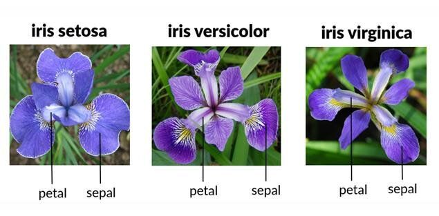

# Visualization of Iris Dataset by R



## Introduction
The Iris flower data set is a renowned multivariate dataset introduced by the British statistician and biologist Ronald Fisher in 1936 in his paper "The use of multiple measurements in taxonomic problems" as a demonstration of linear discriminant analysis. This dataset is alternatively referred to as Anderson's Iris data set due to Edgar Anderson's role in gathering the data to assess the morphological diversity among three closely related species of Iris flowers. The samples were meticulously collected from two species in the Gaspé Peninsula under uniform conditions to ensure consistency.

Comprising 50 samples from each of the three Iris species (Iris setosa, Iris virginica, and Iris versicolor), the dataset includes measurements of four features - sepal length, sepal width, petal length, and petal width - all recorded in centimeters. Fisher utilized these features to construct a linear discriminant model for species classification. The original publication of Fisher's work appeared in the Annals of Eugenics, now recognized as the Annals of Human Genetics. [[1]](https://en.wikipedia.org/wiki/Iris_flower_data_set)

## Notebook
 
You can include R code in the document as follows:

```{r setup, include=FALSE}
knitr::opts_chunk$set(echo = TRUE)
library(hrbrthemes)
library(tidyverse)
library(ggridges)
library(ggthemes)
library(cowplot)
library(viridis)
library(GGally)
```

``` r
dados <- read.csv("input/iris/Iris.csv")
head(dados, 6)
summary(dados)
```

## [To See The Complete Exercise](https://xweih.github.io/iris/)


